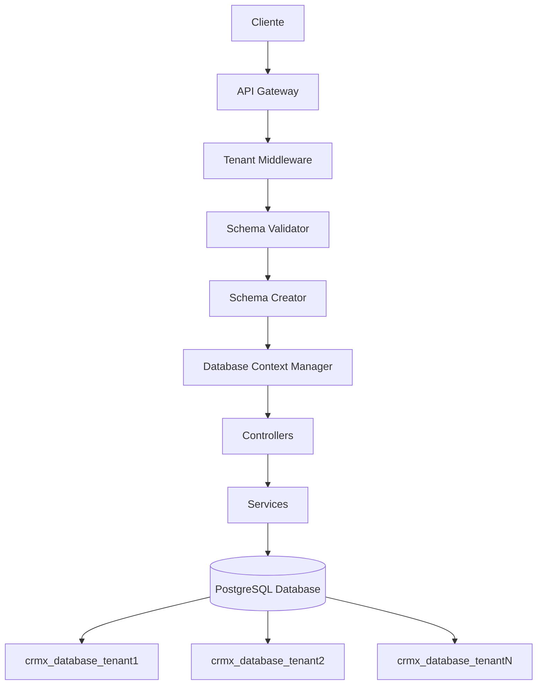
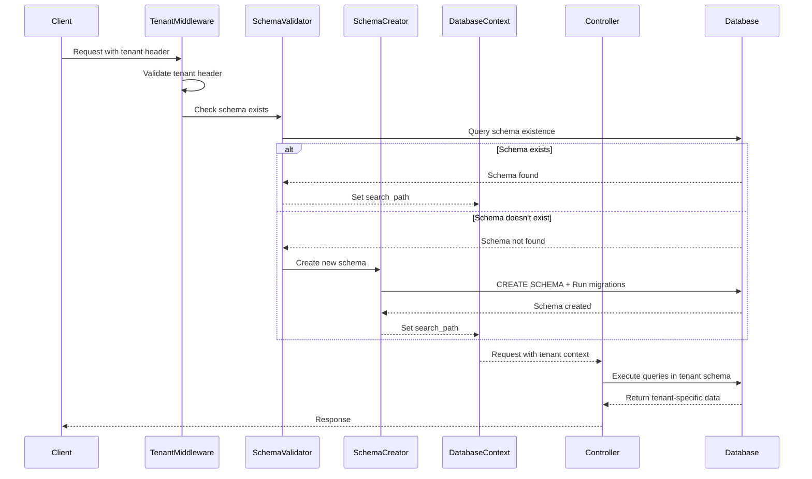

# Design Document - Multi-Tenant Schema Management

## Overview

Este documento descreve o design para implementar um sistema de multi-tenancy baseado em schemas separados por cliente (tenant) na aplicação CRM X. O sistema utilizará PostgreSQL com schemas dinâmicos, onde cada tenant terá seu próprio schema isolado (formato: `crmx_database_{{tenant}}`), garantindo completa separação de dados entre clientes.

A solução implementará um middleware que intercepta todas as requisições, valida o header `tenant`, verifica/cria o schema correspondente e configura o contexto de banco de dados para usar o schema correto durante toda a execução da requisição.

## Architecture

### High-Level Architecture



### Request Flow



## Components and Interfaces

### 1. Tenant Middleware

**Responsabilidade**: Interceptar todas as requisições e processar o header de tenant.

```typescript
interface TenantMiddleware {
  validateTenantHeader(req: Request): string;
  processTenant(req: Request, res: Response, next: NextFunction): Promise<void>;
}
```

**Funcionalidades**:
- Validação do header `tenant`
- Sanitização do valor do tenant
- Integração com Schema Validator
- Configuração do contexto de tenant na requisição

### 2. Schema Validator

**Responsabilidade**: Verificar se o schema do tenant existe no banco de dados.

```typescript
interface SchemaValidator {
  schemaExists(tenantId: string): Promise<boolean>;
  validateSchemaName(tenantId: string): boolean;
  getSchemaName(tenantId: string): string;
}
```

**Funcionalidades**:
- Consulta de existência de schema
- Validação de formato do nome do schema
- Cache de validações para performance

### 3. Schema Creator

**Responsabilidade**: Criar novos schemas e executar migrações.

```typescript
interface SchemaCreator {
  createSchema(tenantId: string): Promise<void>;
  runMigrations(schemaName: string): Promise<void>;
  handleConcurrentCreation(tenantId: string): Promise<void>;
}
```

**Funcionalidades**:
- Criação de schema com nome `crmx_database_{{tenant}}`
- Execução do script `schema.sql` no novo schema
- Tratamento de criação concorrente
- Logging de operações

### 4. Database Context Manager

**Responsabilidade**: Gerenciar o contexto de banco de dados por tenant.

```typescript
interface DatabaseContextManager {
  setTenantContext(tenantId: string): Promise<void>;
  getTenantContext(): string | null;
  resetContext(): Promise<void>;
  executeInTenantContext<T>(tenantId: string, operation: () => Promise<T>): Promise<T>;
}
```

**Funcionalidades**:
- Configuração do `search_path` do PostgreSQL
- Gerenciamento de contexto por requisição
- Isolamento de operações por tenant

### 5. Tenant-Aware Supabase Client

**Responsabilidade**: Extensão do cliente Supabase para suportar multi-tenancy.

```typescript
interface TenantAwareSupabaseClient {
  withTenant(tenantId: string): SupabaseClient;
  executeQuery<T>(query: string, params?: any[]): Promise<T>;
  getClient(): SupabaseClient;
}
```

## Data Models

### Tenant Context

```typescript
interface TenantContext {
  tenantId: string;
  schemaName: string;
  isValidated: boolean;
  createdAt?: Date;
}
```

### Schema Validation Cache

```typescript
interface SchemaValidationCache {
  tenantId: string;
  exists: boolean;
  lastChecked: Date;
  ttl: number;
}
```

### Migration Result

```typescript
interface MigrationResult {
  success: boolean;
  schemaName: string;
  executedAt: Date;
  error?: string;
}
```

## Correctness Properties

*A property is a characteristic or behavior that should hold true across all valid executions of a system-essentially, a formal statement about what the system should do. Properties serve as the bridge between human-readable specifications and machine-verifiable correctness guarantees.*

### Property Reflection

Após revisar todas as propriedades identificadas no prework, identifiquei algumas redundâncias que podem ser consolidadas:

- Propriedades 3.1, 3.2, 3.4 podem ser combinadas em uma propriedade abrangente sobre configuração de contexto de banco
- Propriedades 3.3 e 3.5 podem ser combinadas em uma propriedade sobre isolamento de tenant
- Propriedades 4.1 e 4.2 podem ser combinadas em uma propriedade sobre fluxo de validação de schema
- Propriedades 5.2 e 5.4 podem ser combinadas em uma propriedade sobre processamento de tenant

**Property 1: Tenant header validation**
*For any* HTTP request without a tenant header, the system should return a 400 error with message "Tenant header is required"
**Validates: Requirements 1.1**

**Property 2: Empty tenant header rejection**
*For any* HTTP request with an empty or whitespace-only tenant header, the system should return a 400 error with message "Tenant header cannot be empty"
**Validates: Requirements 1.2**

**Property 3: Valid tenant extraction**
*For any* HTTP request with a valid tenant header, the system should successfully extract the tenant value and make it available for processing
**Validates: Requirements 1.3**

**Property 4: Invalid tenant format rejection**
*For any* HTTP request with a tenant header containing invalid characters, the system should return a 400 error with message "Invalid tenant format"
**Validates: Requirements 1.4**

**Property 5: Automatic schema creation**
*For any* valid tenant that doesn't have a corresponding schema, the system should create a new schema named "crmx_database_{{tenant}}"
**Validates: Requirements 2.1**

**Property 6: Schema migration execution**
*For any* newly created schema, the system should execute the complete migration script and create all required tables and indexes
**Validates: Requirements 2.2**

**Property 7: Schema creation error handling**
*For any* schema creation operation that fails, the system should return a 500 error with details about the failure
**Validates: Requirements 2.3**

**Property 8: Schema creation logging**
*For any* successful schema creation, the system should generate a log entry containing the tenant information and creation timestamp
**Validates: Requirements 2.4**

**Property 9: Concurrent schema creation safety**
*For any* tenant with multiple concurrent requests, only one schema should be created without conflicts or errors
**Validates: Requirements 2.5**

**Property 10: Database context configuration**
*For any* tenant request, the system should configure the database connection to use the correct tenant-specific schema throughout the entire request lifecycle
**Validates: Requirements 3.1, 3.2, 3.4**

**Property 11: Tenant isolation maintenance**
*For any* combination of concurrent requests from different tenants, the system should maintain complete data isolation between tenants
**Validates: Requirements 3.3, 3.5**

**Property 12: Schema existence validation**
*For any* incoming request, the system should verify schema existence and proceed with normal processing when the schema is found
**Validates: Requirements 4.1, 4.2**

**Property 13: Database connectivity error handling**
*For any* schema validation that fails due to database connectivity issues, the system should return a 503 error
**Validates: Requirements 4.3**

**Property 14: Malformed schema name validation**
*For any* request with a malformed tenant identifier, the system should return a 400 error before attempting database operations
**Validates: Requirements 4.4**

**Property 15: Schema validation caching**
*For any* successful schema validation, the system should cache the result and reuse it for subsequent requests within the TTL period
**Validates: Requirements 4.5**

**Property 16: Tenant processing and context propagation**
*For any* API endpoint request, the system should process the tenant header before business logic and make tenant information available throughout the request chain
**Validates: Requirements 5.2, 5.4**

**Property 17: Access control on tenant failure**
*For any* request where tenant processing fails, the system should prevent access to all protected resources
**Validates: Requirements 5.3**

**Property 18: Resource cleanup**
*For any* completed request, the system should properly clean up all tenant-specific resources and context
**Validates: Requirements 5.5**

## Error Handling

### Error Types and Responses

1. **Tenant Header Errors (400)**
   - Missing tenant header
   - Empty tenant header
   - Invalid tenant format
   - Malformed tenant identifier

2. **Schema Creation Errors (500)**
   - Database connection failures during creation
   - Migration script execution failures
   - Insufficient database permissions

3. **Database Connectivity Errors (503)**
   - Database unavailable during schema validation
   - Connection timeout during operations

4. **Concurrent Access Handling**
   - Schema creation locks to prevent race conditions
   - Retry mechanisms for transient failures
   - Proper error propagation for permanent failures

### Error Response Format

```typescript
interface ErrorResponse {
  error: {
    code: string;
    message: string;
    details?: any;
    requestId: string;
    timestamp: string;
  };
}
```

## Testing Strategy

### Dual Testing Approach

O sistema utilizará tanto testes unitários quanto testes baseados em propriedades para garantir cobertura abrangente:

**Unit Testing**:
- Testes específicos para casos de uso conhecidos
- Validação de integração entre componentes
- Testes de casos extremos específicos
- Verificação de comportamentos de erro conhecidos

**Property-Based Testing**:
- Utilizaremos a biblioteca **fast-check** (já disponível no projeto) para implementar testes baseados em propriedades
- Cada teste de propriedade executará um mínimo de 100 iterações para garantir cobertura adequada
- Cada teste será marcado com comentário referenciando a propriedade correspondente no documento de design
- Formato do comentário: `**Feature: multi-tenant-schema-management, Property {number}: {property_text}**`

**Configuração de Testes**:
- Testes de propriedade configurados para 100+ iterações
- Geradores inteligentes para dados de teste realistas
- Ambiente de teste isolado com banco PostgreSQL dedicado
- Limpeza automática de schemas de teste após execução

**Cobertura de Testes**:
- Validação de headers de tenant
- Criação e validação de schemas
- Isolamento de dados entre tenants
- Tratamento de erros e casos extremos
- Performance e concorrência

### Test Environment Setup

```typescript
// Configuração de ambiente de teste
interface TestEnvironment {
  database: {
    host: string;
    port: number;
    database: string;
    user: string;
    password: string;
  };
  cleanup: {
    autoCleanupSchemas: boolean;
    testSchemaPrefix: string;
  };
}
```

## Implementation Considerations

### Performance Optimizations

1. **Schema Validation Caching**
   - Cache em memória para validações de schema
   - TTL configurável (padrão: 5 minutos)
   - Invalidação automática em caso de erros

2. **Connection Pooling**
   - Pool de conexões por tenant quando necessário
   - Reutilização de conexões para o mesmo tenant
   - Limpeza automática de conexões inativas

3. **Concurrent Request Handling**
   - Locks distribuídos para criação de schema
   - Queue de requisições para novos tenants
   - Retry logic para operações transientes

### Security Considerations

1. **Tenant Isolation**
   - Validação rigorosa de nomes de tenant
   - Prevenção de SQL injection através de sanitização
   - Isolamento completo de dados por schema

2. **Access Control**
   - Validação de permissões por tenant
   - Auditoria de operações de schema
   - Rate limiting por tenant

### Monitoring and Observability

1. **Logging**
   - Log estruturado para todas as operações de tenant
   - Métricas de performance por tenant
   - Alertas para falhas de criação de schema

2. **Health Checks**
   - Verificação de conectividade de banco
   - Validação de schemas existentes
   - Monitoramento de uso de recursos

## Migration Strategy

### Existing Data Migration

Para aplicações existentes que precisam migrar para multi-tenancy:

1. **Schema Migration**
   - Identificação de dados existentes por tenant
   - Criação de scripts de migração por tenant
   - Validação de integridade após migração

2. **Rollback Strategy**
   - Backup completo antes da migração
   - Scripts de rollback testados
   - Plano de contingência para falhas

### Deployment Considerations

1. **Zero-Downtime Deployment**
   - Deploy gradual do middleware
   - Fallback para comportamento anterior
   - Monitoramento contínuo durante deploy

2. **Database Schema Versioning**
   - Versionamento de schemas por tenant
   - Migração automática de versões
   - Compatibilidade com versões anteriores