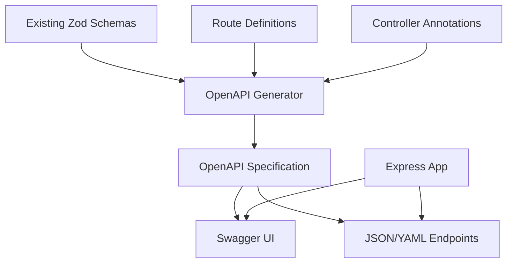

# Design Document

## Overview

Este documento descreve o design para implementar documentação Swagger/OpenAPI completa para o sistema CRM. A solução aproveitará os schemas Zod existentes e criará uma documentação interativa e sempre atualizada que será servida junto com a aplicação.

## Architecture

### High-Level Architecture



### Technology Stack

- **zod-to-openapi**: Converte schemas Zod existentes para especificação OpenAPI
- **swagger-ui-express**: Serve interface Swagger UI interativa
- **@apidevtools/swagger-jsdoc**: Para documentação adicional via JSDoc
- **express**: Framework web existente (sem mudanças)

### Integration Approach

1. **Schema-First**: Aproveitar schemas Zod existentes como fonte de verdade
2. **Annotation-Based**: Adicionar decorators/comentários mínimos nos controllers
3. **Auto-Generation**: Gerar especificação OpenAPI automaticamente
4. **Runtime Serving**: Servir documentação como parte da aplicação

## Components and Interfaces

### 1. OpenAPI Generator Service

```typescript
interface OpenAPIGeneratorService {
  generateSpecification(): OpenAPISpecification;
  registerSchema(name: string, schema: ZodSchema): void;
  registerEndpoint(path: string, method: string, config: EndpointConfig): void;
}

interface EndpointConfig {
  summary: string;
  description: string;
  tags: string[];
  requestSchema?: ZodSchema;
  responseSchema?: ZodSchema;
  parameters?: ParameterConfig[];
}
```

### 2. Schema Registry

```typescript
interface SchemaRegistry {
  registerEntitySchemas(): void;
  getOpenAPISchemas(): Record<string, OpenAPISchema>;
  convertZodToOpenAPI(schema: ZodSchema): OpenAPISchema;
}
```

### 3. Documentation Middleware

```typescript
interface SwaggerMiddleware {
  setupSwaggerUI(app: Express): void;
  serveOpenAPISpec(app: Express): void;
  configureAuthentication(): void;
}
```

### 4. Route Documentation

```typescript
interface RouteDocumentation {
  documentCRUDRoutes(entity: string, schemas: EntitySchemas): void;
  documentDashboardRoutes(): void;
  generateExamples(schema: ZodSchema): any;
}
```

## Data Models

### OpenAPI Specification Structure

```yaml
openapi: 3.0.3
info:
  title: CRM System API
  version: 1.0.0
  description: Sistema de gerenciamento de relacionamento com clientes
servers:
  - url: http://localhost:3000/api
    description: Development server
paths:
  # Auto-generated from routes
components:
  schemas:
    # Auto-generated from Zod schemas
  securitySchemes:
    bearerAuth:
      type: http
      scheme: bearer
      bearerFormat: JWT
```

### Entity Schema Mapping

```typescript
// Existing Zod schemas will be converted to OpenAPI
const UserSchema = z.object({
  id: z.string().uuid(),
  name: z.string(),
  email: z.string().email(),
  role: z.enum(['ADMIN', 'MANAGER', 'SALES_REP'])
});

// Converts to OpenAPI:
{
  "User": {
    "type": "object",
    "properties": {
      "id": { "type": "string", "format": "uuid" },
      "name": { "type": "string" },
      "email": { "type": "string", "format": "email" },
      "role": { "type": "string", "enum": ["ADMIN", "MANAGER", "SALES_REP"] }
    },
    "required": ["id", "name", "email", "role"]
  }
}
```

## Correctness Properties

*A property is a characteristic or behavior that should hold true across all valid executions of a system-essentially, a formal statement about what the system should do. Properties serve as the bridge between human-readable specifications and machine-verifiable correctness guarantees.*

### Property Reflection

Analisando os critérios de aceitação identificados no prework:

**Propriedades Identificadas:**
1. **Documentation completeness**: Todos os endpoints devem estar documentados
2. **Schema accuracy**: Schemas OpenAPI devem corresponder aos schemas Zod
3. **Interactive functionality**: Swagger UI deve permitir testes de todos endpoints
4. **Authentication integration**: JWT deve funcionar através da interface
5. **Example validity**: Exemplos devem ser válidos conforme schemas
6. **Auto-sync**: Documentação deve refletir mudanças no código automaticamente

**Redundâncias Eliminadas:**
- Propriedades 1 e 2 do prework podem ser combinadas em "Documentation completeness"
- Propriedades 3 e 4 podem ser unificadas em "Interactive testing capability"
- Propriedades relacionadas a exemplos podem ser consolidadas

### Final Properties

**Property 1: Complete endpoint documentation**
*For any* API endpoint defined in the application routes, the generated OpenAPI specification should include that endpoint with complete request/response schemas, parameters, and examples
**Validates: Requirements 1.1, 1.2, 5.1, 5.2, 5.3**

**Property 2: Schema conversion accuracy**
*For any* Zod schema used in the application, the corresponding OpenAPI schema should preserve all validation rules, field types, constraints, and enum values
**Validates: Requirements 2.1, 2.2, 2.4, 3.1, 3.3**

**Property 3: Interactive functionality**
*For any* documented endpoint in Swagger UI, the "Try it out" feature should allow successful API calls with proper authentication, parameter handling, and response display
**Validates: Requirements 4.1, 4.2, 4.3, 4.4**

**Property 4: Example generation validity**
*For any* generated example in the documentation, it should pass validation against the corresponding schema and accurately represent the expected data structure
**Validates: Requirements 6.1, 6.2, 6.3, 6.5**

**Property 5: Query parameter documentation**
*For any* list endpoint with query parameters, the documentation should include all available parameters with their types, formats, and valid values
**Validates: Requirements 8.1, 8.2, 8.3, 8.4, 8.5**

**Property 6: Documentation accessibility**
*For any* HTTP request to documentation endpoints, the system should serve the Swagger UI interface and raw OpenAPI specification with proper HTTP responses
**Validates: Requirements 7.1, 7.2, 7.3**

**Property 7: Auto-synchronization**
*For any* change in API schemas, routes, or validation rules, the OpenAPI specification should automatically reflect the updates without manual intervention
**Validates: Requirements 3.1, 3.2, 3.3**

## Error Handling

### Documentation Generation Errors

```typescript
class DocumentationError extends Error {
  constructor(
    message: string,
    public readonly component: string,
    public readonly details?: any
  ) {
    super(message);
  }
}

// Error scenarios:
// - Invalid Zod schema conversion
// - Missing route documentation
// - OpenAPI specification validation failures
// - Swagger UI serving errors
```

### Runtime Error Handling

- **Schema Conversion Failures**: Log warnings, use fallback generic schema
- **Missing Documentation**: Generate basic documentation from route structure
- **Authentication Errors**: Provide clear error messages in Swagger UI
- **Validation Errors**: Show detailed field-level validation messages

## Testing Strategy

### Unit Testing Approach

**Unit tests will verify:**
- Zod to OpenAPI schema conversion accuracy
- Route documentation generation
- Example data generation validity
- OpenAPI specification structure compliance

**Key test scenarios:**
- Convert complex nested Zod schemas
- Generate documentation for CRUD routes
- Validate generated examples against schemas
- Test authentication configuration

### Property-Based Testing Approach

**Property tests will verify universal behaviors:**
- Schema conversion consistency across all entity types
- Documentation completeness for all route patterns
- Example validity for all generated data
- Auto-sync behavior for schema changes

**Testing framework:** Jest with fast-check for property-based testing
**Minimum iterations:** 100 per property test
**Coverage target:** All API endpoints and schema types

### Integration Testing

- Test complete Swagger UI functionality
- Verify API calls through documentation interface
- Test authentication flow end-to-end
- Validate documentation accessibility

### Testing Implementation Notes

- Use existing Jest configuration
- Create test utilities for schema validation
- Mock HTTP requests for integration tests
- Test both development and production configurations